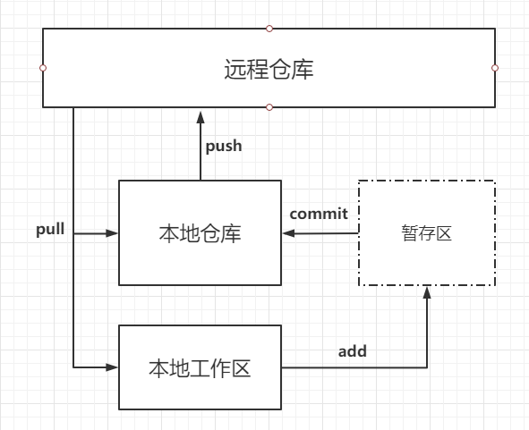
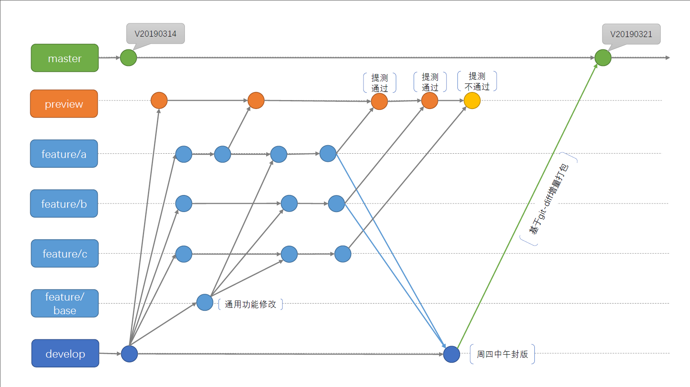

# Git版本控制工具



## 工作流程

```shell
# 从远程仓库获取最新内容
git pull
# 将本地文件添加进暂存区
git add
# 将暂存区文件提交到本地仓库
git commit
# 将本地仓库文件推送到远程仓库
git push
```

## 分支切换



```shell
# 查看所有分支，*代表当前分支
git branch
# 创建新的分支
git branch [name]
# 删除分支 -D:强制删除
git branch -d [name]

# 切换分支 -b:若当前没有该分支，则创建后切换
git checkout [name]
# 合并分支
git merge
# 分支暂存
git stash
```


## 安装与配置

略

## 设置用户

> **Linux环境下**
>
> git的系统配置文件一般会安装在 /etc/gitconfig，当使用--system选项时，会从此文件读取配置，应用于所有用户；
>
> 单用户的配置文件会放在~/.gitconfig，只针对当前用户，当使用--global选项时，会从此文件读取配置；
>
> 单仓库的配置文件会在每个项仓库下的.git/config文件
>
> **Windows环境下**
>
> 全局配置文件放在C:\User\$User\\.gitconfig
>
> 单仓库的配置文件会在每个项仓库下的.git/config文件

```shell
git config --global user.name "John Doe"
git config --global user.email johndoe@example.com
```

--global 选项会将命令配置到全局配置文件中，每一次的git操作都会默认使用该用户信息

当你想针对特定项目使用不同的用户名称与邮件地址时，可以在那个项目目录下运行没有 --global 选项的命令来配置

**有很多工具会在第一次提交的时候讲用户信息自动写入全局配置文件**

```shell
# 用户可通过命令查看当前git配置
# 查看当前用户
git config user.name
# 查看当前用户邮箱
git config user.email
# 查看git所有配置
git config --list
```


## 获取仓库

### 导入本地项目到git

```shell
# 在本地目录初始化git信息，此命令会生成一个.git文件夹
git init
# 将你本地的已有文件添加到本地git仓库中，“.”代表当前目录下所以文件及子文件。也可以指定文件添加，支持*通配符
git add .
# 将加入git仓里的文件提交到仓库
git commit -m '提交备注信息';
```

### 克隆已有仓库到本地

`git clone url`会在当前文件夹下创建一个项目名同名的目录。并在这个目录下初始化一个 .git 文件夹，从远程仓库拉取下所有数据放入 .git 文件夹，然后从中读取最新版本的文件的拷贝到该文件夹。你也可以通过`git clone url [name]`，重命名文件夹名称。


## 文件状态

Untracked：未被跟踪

Unmodified：未修改

Modified：已修改

Staged：暂存


