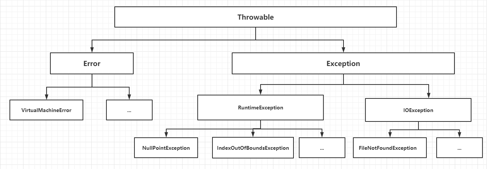

# JAVA 基础知识总结

## JAVA 三大版本

1. **Java SE**：标准版 应用于桌面程序、控制台开发

2. **Java ME**：嵌入式开发

3. **Java EE / J2EE**：企业级开发 应用于服务器开发

## JDK、JRE、JVM

java作为跨平台的高级编程语言，**一次编译，多处运行**。首先要了解其开发运行所依赖的环境

1. **JDK：Java Development kit** 

   java开发环境，主要面向开发者，其中包含了java开发所需要的工具包，具有编译功能，将java文件编译为class文件，便于执行

2. **JRE：Java Runtime Enviroment**   

   java运行环境，主要面向用户，可运行编译后的class文件

3. **JVM： Java Virtual Machin**   

   java虚拟机，是java实现跨平台的核心，提供了一套与平台无关的代码执行方法。jre就是在此虚拟机上解释执行class文件

**三者关系为：JDK中包含了JRE；JRE中包含了JVM**

## 执行过程

Java是一种**编译型加解释型**语言，先通过编译器（javac.exe）将java代码编译成.class文件，即JVM的机器语言。再通过解释器（java.exe）将编译后的程序逐步解释给操作系统执行。

> **编译型语言**：将计算机不能识别的高级编程语言，转化为成计算机可执行的语言，编译成一个可执行文件。进行执行
>
> 优点是执行效率快，消耗内存小，但其编译后的可执行文件比解释型的可执行文件大，且编译后的文件依赖平台
>
> **解释型语言**：将计算机不能识别的高级编程语言，一句一句解释成机器语言并执行
>
> 其中间语言代码量小。且具有平台独立性
>
> 所以java初学者经常会通过javac命令将文本文档编写的java文件编译成class文件，再通过java命令执行编译后的class文件。

## 第一个java程序

```java
class test01 {
    public static void main(String[] args) {
        System.out.println("Hello World!");
    }
}
```

**编译 - 解释执行**

```shell
# 查看jdk版本
>java -version
java version "1.8.0_171"
Java(TM) SE Runtime Environment (build 1.8.0_171-b11)
Java HotSpot(TM) 64-Bit Server VM (build 25.171-b11, mixed mode)
# 编译
>javac test01.java
# 解析执行
>java test01
Hello World!
```

## 标识符

**关键字**：系统预先定义好的一批词语，程序自定义的标识符不允许以此命名

> String、Integer等是内置类，不是关键字

| **关键字**   | **含义**                                                     |
| ------------ | ------------------------------------------------------------ |
| abstract     | 表明类或者成员方法具有抽象属性                               |
| assert       | 断言，用来进行程序调试                                       |
| boolean      | 基本数据类型之一，声明布尔类型的关键字                       |
| break        | 提前跳出一个块                                               |
| byte         | 基本数据类型之一，字节类型                                   |
| case         | 用在switch语句之中，表示其中的一个分支                       |
| catch        | 用在异常处理中，用来捕捉异常                                 |
| char         | 基本数据类型之一，字符类型                                   |
| class        | 声明一个类                                                   |
| const        | 保留关键字，没有具体含义                                     |
| continue     | 回到一个块的开始处                                           |
| default      | 默认，例如，用在switch语句中，表明一个默认的分支。Java8 中也作用于声明接口函数的默认实现 |
| do           | 用在do-while循环结构中                                       |
| double       | 基本数据类型之一，双精度浮点数类型                           |
| else         | 用在条件语句中，表明当条件不成立时的分支                     |
| enum         | 枚举                                                         |
| extends      | 表明一个类型是另一个类型的子类型。对于类，可以是另一个类或者抽象类；对于接口，可以是另一个接口 |
| final        | 用来说明最终属性，表明一个类不能派生出子类，或者成员方法不能被覆盖，或者成员域的值不能被改变，用来定义常量 |
| finally      | 用于处理异常情况，用来声明一个基本肯定会被执行到的语句块     |
| float        | 基本数据类型之一，单精度浮点数类型                           |
| for          | 一种循环结构的引导词                                         |
| goto         | 保留关键字，没有具体含义                                     |
| if           | 条件语句的引导词                                             |
| implements   | 表明一个类实现了给定的接口                                   |
| import       | 表明要访问指定的类或包                                       |
| instanceof   | 用来测试一个对象是否是指定类型的实例对象                     |
| int          | 基本数据类型之一，整数类型                                   |
| interface    | 接口                                                         |
| long         | 基本数据类型之一，长整数类型                                 |
| native       | 用来声明一个方法是由与计算机相关的语言（如C/C++/FORTRAN语言）实现的 |
| new          | 用来创建新实例对象                                           |
| package      | 包                                                           |
| private      | 一种访问控制方式：私用模式                                   |
| protected    | 一种访问控制方式：保护模式                                   |
| public       | 一种访问控制方式：共用模式                                   |
| return       | 从成员方法中返回数据                                         |
| short        | 基本数据类型之一,短整数类型                                  |
| static       | 表明具有静态属性                                             |
| strictfp     | 用来声明FP_strict（单精度或双精度浮点数）表达式遵循[IEEE 754](https://baike.baidu.com/item/IEEE 754)算术规范 |
| super        | 表明当前对象的父类型的引用或者父类型的构造方法               |
| switch       | 分支语句结构的引导词                                         |
| synchronized | 表明一段代码需要同步执行                                     |
| this         | 指向当前实例对象的引用                                       |
| throw        | 抛出一个异常                                                 |
| throws       | 声明在当前定义的成员方法中所有需要抛出的异常                 |
| transient    | 声明不用序列化的成员域                                       |
| try          | 尝试一个可能抛出异常的程序块                                 |
| void         | 声明当前成员方法没有返回值                                   |
| volatile     | 表明两个或者多个变量必须同步地发生变化                       |
| while        | 用在循环结构中                                               |

**自定义标识符规则：**

1. 必须以字母、美元符($)、下划线(_)开始，如

2. 首字母之后可以包含字母、美元符($)、下划线(_)、数字

3. 标识符是大小写敏感的

## 注释

> 代码是写给机器执行的，注释是写给开发人员阅读的
>
> 注释不会出现在编译后的class文件中，并不会影响代码的执行

```java
// 单行注释

/*
 * 多行注释
 * 
 */

/**
 * 头注释（用于方法、类上解释其功能、参数、返回值）
 * @Description 
 * @Author
 */
```

## 数据类型

java数据类型分为**基本数据类型**和**引用数据类型**

> java中0开头代表八进制、0x开头代表十六进制、\开头代表转义、\u开头代表unicode字符

### 基本数据类型

1. **byte**：占1个字节【-128 ~ 127】

2. **short**：占2个字节【-32768 ~ 32767】

3. **int**：占4个字节【-2147483648 ~ 2147483647】

4. **long**：占8个字节 

5. **float**：占4个字节【8位有效位】

6. **double**：占8个字节【17位有效位】

7. **char**：占2个字节【一个字符】

8. **boolean**：占1个Bit

**long、float在定义时要加上L、F后缀，以用来区分int和double类型**

> **数据类型转换：**
>
> 优先级(低 -> 高) **byte, short, char -> int -> long -> float -> double**
>
> **低 -> 高 自动类型转换** `int a = 100;long b = a;`
>
> **高 -> 低 强制类型转换**  (数据类型) 数据`long a = 100L; int b = (int)a`
>
> **布尔值不能转换**
>
> **每一个基本数据类型都有其默认值**
>
> ```
> byte: 0
> short: 0
> int: 0
> long: 0
> float: 0.0
> double: 0.0
> char:  (一个半角空格)
> boolean: false
> ```

### 引用数据类型

> 引用数据类型即java为每一个基本数据类型提供了一个封装类，并为每一种数据类型提供了一些基本的操作方法
>
> 基本数据类型直接存在栈内存中，效率更高，但是没有常用的操作方法
>
> 引用数据类型实际值存在堆内存中，在栈内存中存放对象的引用，只能通过引用访问。

**Byte，Short，Integer，Long，Float，Double，String，Boolean**

## 运算符

四则运算：+ - * / %(求余)

自增运算：++

自减运算：--

等于判断：== 

不等于判断：!=

与或非逻辑运算：&& || !

三元表达式：? :

赋值运算：+= -= 

位运算符：&、 |、^、 ~、 <<、 >>

```java
public static void main(String[] args) {
    int a = 10;
    int b = 3;
    int c = 1;
    int d = 1;
    int e = 1;
    System.out.println("a + b = " + (a + b)); // a + b = 13
    System.out.println("a - b = " + (a - b)); // a - b = 7
    System.out.println("a * b = " + (a * b)); // a * b = 30
    System.out.println("a / b = " + (a / b)); // a / b = 3
    System.out.println("a % b = " + (a % b)); // a / b = 1
    int f = c++;
    int f = ++c;
    System.out.println("c++ = " + (c++)); // c++ = 1
    System.out.println("c++之后，c = " + c); // c++之后，c = 2
    System.out.println("++c = " + (++c)); // ++c = 3
    System.out.println("++c之后，c = " + c); // ++c之后，c = 3
    System.out.println("d-- = " + (d--)); // d-- = 1
    System.out.println("d--之后，d = " + d); // d--之后，d = 0
    System.out.println("--d = " + (--d)); // --d = -1
    System.out.println("--d之后，d = " + d); // --d之后，d = -1
    System.out.println("a == b: " + (a == b)); // a == b: false
    System.out.println("a != b: "+ (a != b)); // a != b: true
    System.out.println("a == 10 && b == 10: " + (a == 10 && b == 10)); // a == 10 && b == 10: false
    System.out.println("a == 10 || b == 10: " + (a == 10 || b == 10)); // a == 10 || b == 10: true
    System.out.println("!(a == 10): " + !(a == 10)); // !(a == 10): false
    System.out.println("a == 10 ? a : b = " + (a == 10 ? a : b)); // a == 10 ? a : b = 10
    e += 10; e = e + 10;
    System.out.println("e += 10之后，e = " + e); // e += 10之后，e = 11
    e -= 10; e = e - 10;
    System.out.println("e -= 10之后，e = " + e); // e -= 10之后，e = 1
}
```

## 数组

> 一类相同数据类型的数据的有序集合
>
> 数组大小初始化的时候定义，不能改变。可通过数组下表访问元素，下标从0开始

**一维数组 **

定义：数据类型[] 变量名

初始化：

​    数据类型[] 变量名 = new 数据类型[元素个数]

​    数据类型[] 变量名 = new 数据类型[]{逗号分隔数据集合}；  

​    数据类型[] 变量名 = {逗号分隔数据集合}；

```java
public static void main(String[] args) {
    // 初始化空数组
    int[] a = new int[5];
    
    // 往数组中添加数据
    a[0] = 0;
    a[1] = 1;
    a[2] = 2;
    a[3] = 3;
    a[4] = 4;
    
    // 带初始数据初始化数组
    int[] b = new int[]{0, 1, 2, 3, 4};
    int[] c = {0, 1, 2, 3, 4};
}
```

**多维数组**

定义：数据类型\[][] 变量名

初始化：

​    数据类型\[][] 变量名 = new 数据类型\[元素个数][元素个数]

​    数据类型\[][] 变量名 = new 数据类型[]{{}, {}}；  

​    数据类型\[][] 变量名 = {{}, {}}；

> 多维数组，第一维长度必须在初始化的时候定义，其他维度可以不定长

```java
public static void main(String[] args) {
    // 初始化空数组
    int[][] a = new int[5][];
    // 往数组中添加数据
    // a[0] = {0, 1, 2, 3};
    // a[1] = new int[]{0, 1, 2};
	 a[2][1] = 10; // 当第二位初始化没有初始化长度时，不能直接添加往第二维添加数据
    a[2] = new int[5];
    a[2][0] = 0;
    a[2][1] = 1;
    a[2][2] = 2;
    a[2][3] = 3;
    a[2][4] = 4;
    System.out.println(a.length + " " + a[0].length + " " + a[1].length + " " + a[2].length); // 5 5 3 5
    // 带初始数据初始化数组
    int[][] b = new int[][]{{0, 1, 2, 3, 4}, {0, 1, 2, 3, 4}};
    int[][] c = {{0, 1, 2, 3, 4}, {0, 1, 2, 3, 4}};
}
```

## 结构

### 顺序结构

```java
public static void main(String[] args) {
    System.out.println(1);
    System.out.println(2);
    System.out.println(3);
    System.out.println(4);
}
```

### 选择结构

**if-else**

```java
public static void main(String[] args) {
    int a = 2;
    if (a == 1) {
        System.out.println(1);
    } else if (a == 2) {
        System.out.println(2);
    } else if (a == 3) {
        System.out.println(3);
    } else {
        System.out.println(4);
    }
}
```

**switch-case**

> switch中只能接受**byte short int char string**
>
> 每个case分支要有break；语句跳出循环，否则会从当前分支顺序执行下去

```java
public static void main(String[] args) {
    int a = 2;
    switch (a) {
        case 1:
            System.out.println(1);
            break;
        case 2:
            System.out.println(2);
            break;
        case 3:
            System.out.println(3);
            break;
        default:
            System.out.println(4);
    }
}
```

> **switch-case** 会生成跳转表，然后根据传入只直接跳到匹配分支执行。占用内存多，但是效率高
>
> **if-else** 会遍历分支条件，直至命中条件

### 循环结构

**while**

```java
public static void main(String[] args) {
    int a = 0;
    while(a <= 10) {
        System.out.println(a);
        a++;
    }
}
```

**do..while**

```java
public static void main(String[] args) {
    int a = 0;
    do {
        System.out.println(a);
        a++;
    } while((a <= 10));
}
```

> while循环，循环体可能不被执行
>
> do...while循环，循环体至少被执行一次

**for**

```java
public static void main(String[] args) {
    for(int i = 0; i <= 10; i++) {
        System.out.println(i);
    }
}
```

> while循环适合于简单的循环逻辑。循环内无法控制当前循环索引。
>
> for循环可在循环的同时控制当前索引，适用于循环的同时操作当前集合数据。

**增强for**

```java
public static void main(String[] args) {
    String[] a = new String[]{"a", "b", "c", "d"};
    for(String str : a) {
        System.out.println(str);
    }
}
```

> 增强for循环适用于引用数据类型遍历，可直接获取循环当前的元素。
>
> 增强For循环每次获取的是集合中元素的浅copy的值，修改会直接改变原有集合的值
>
> 普通For循环通过下标编辑，修改的话就会直接修改了原集合

**break-contionue**

> break：跳出当前循环
>
> continue：继续下一次循环

```java
public static void main(String[] args) {
    int i = 0;
    while (true) {
        if (i % 2 == 0) {
            i++;
            continue;
        }
        if (i == 15) {
            break;
        }
        System.out.println(i++);
    }
}
```

## 方法

方法（函数）： 解决一类问题的代码集合

**方法的定义**

**修饰符 返回类型 方法名(参数类型 参数名 ...) { }**

> 当方法不需要返回数据时，返回类型用void，方法体中不用return；

```java
public Integer add(Integer a, Integer b) { 
    return a + b; 
}
```

**方法重载**

> 由于java是强类型语言，方法在定义时，参数个数，参数类型，参数顺序都已确定。
>
> 但在实际情况中，可能使用起来不够灵活，同一行为可能会根据传参不同表现出不同的结果。

> 方法名相同，但参数列表不同（表现为：类型、个数、顺序，即保证通过参数能匹配到唯一的一个方法）的方法称为方法的重载**overloading**
>
> 返回类型可相同也可不相同

```java
public Integer add(Integer a, Integer b) { 
    return a + b; 
}

public Integer add(Integer a, Integer b, Integer c) { 
    return a + b + c; 
}
```

**可变参数**

**定义格式：数据类型... 参数名**

> 每个方法中只能有一个可变参数，且只能放在最后一个。

```java
public Integer add(Integer... a) {
    for (Integer num : a) {
        sum += num;
    }
    return sum;
}

add(1, 2, 3, 4, 5, 6, 7)
```

## 面向对象

**面向过程**： 步骤清晰，按步执行，适合处理简单问题

**面向对象**：将同一类事务的属性和行为抽象总结，更符合人类思考问题的方式，适合处理复杂的多人协作的问题

### 类与对象

**类**：同一类事务的属性和行为抽象总结出的信息为一个类。

**对象**：类的实例化产物为对象

**以类的方式组织代码，以对象的方式封装数据**

```java
// 人类
class Pserion {
    String male; // 性别
    int hight; // 身高
    int age; // 年龄
    
    // 表达
    public String talk(String message) { 
    	return message;
    }
    
    // 思考
    public void think() {}
}
```

```java
public static void main(String[] args) {
    // 通过人类实例化出人的对象
    Persion jack = new Persion();
}
```

### 构造函数

**名称与类名相同，且无返回类型，是通过类实例化对象的时候会被调用的函数**

`public Persion() {}`

> 当创建一个类后，默认会有一个隐藏的无参构造函数，用户可通过方法的重载自定义有参构造函数。
>
> 但当用户自定义有参构造函数时，默认的无参构造函数会失效，此时若需要，则需显示定义。

```java
class Pserion {
    String gender; // 性别
    int hight; // 身高
    int age; // 年龄
    
    // 无参构造函数
    public Persion() {}
    
    // 重载有参构造函数
    public Persion(String genderInput, int hightInput, int ageInput) {
        gender = genderInput;
        hight = hightInput;
        age = ageInput;
    }
    
    // 表达
    public void talk(String message) { 
    	System.out.println("Hi, I'm a " + high + "cm tall " + gender + "and I'm " + age  + " years old now, I want to tall you '" +  message + "'");
    }
    
    // 思考
    public void think() {}
}
```

```java
public static void main(String[] args) {
    Persion jack = new Persion("man", 180, 20);
    jack.age = 100;
    jack.talk("Nice to meet you!"):
}
```

### 面向对象三的特性

#### 封装 

**隐藏实现细节，保护数据，对外只提供特定的可调用的接口或方法，提高安全性**

```java
class Pserion {
    private String gender; // 性别
    private int hight; // 身高
    private int age; // 年龄
    
    public Persion() {}
    
    public Persion(String genderInput, int hightInput, int ageInput) {
        gender = genderInput;
        hight = hightInput;
        age = ageInput;
    }
    
    // 表达
    public void talk(String message) { 
    	System.out.println("Hi, I'm a " + hight + "cm tall " + gender + " and I'm " + age  + " years old now, I want to tall you '" +  message + "'");
    }
    
    // 思考
    public void think() {}
    
    public String getGender() {
        return gender;
    }

    /*public void setGender(String gender) {
        this.gender = gender;
    }*/

    public int getHight() {
        return hight;
    }

    public void setHight(int hight) {
        this.hight = hight;
    }

    public int getAge() {
        return age;
    }

    public void setAge(int age) {
        this.age = age;
    }
}
```

```java
public static void main(String[] args) {
    Persion jack = new Persion("man", 180, 20);
    jack.setAge(18);
    jack.setHight(150);
    jack.talk("Nice to meet you!"):
}
```

#### 继承

​    **关键字：extends**

> 所有类默认继承Object

```java
class Persion {
    String gender; // 性别
    int hight; // 身高
    int age; // 年龄
    String skinColor; // 肤色

    public Persion() {}

    public Persion(String skinColorInput, String genderInput, int hightInput, int ageInput) {
        skinColor = skinColorInput;
        gender = genderInput;
        hight = hightInput;
        age = ageInput;
    }

    // 表达
    public void talk(String message) {
        System.out.println("Hi, I'm a " + hight + "cm tall " + gender + " and I'm " + age  + " years old now, I want to tall you '" +  message + "'");
    }

    // 思考
    public void think() {}

    public String getGender() {
        return gender;
    }

    public void setGender(String gender) {
        this.gender = gender;
    }

    public int getHight() {
        return hight;
    }

    public void setHight(int hight) {
        this.hight = hight;
    }

    public int getAge() {
        return age;
    }

    public void setAge(int age) {
        this.age = age;
    }

    public String getSkinColor() {
        return skinColor;
    }

    public void setSkinColor(String skinColor) {
        this.skinColor = skinColor;
    }
}
```

```java
class Chinese extends Persion {
    @Override
    public void talk(String message) {
        super.talk(message);
        System.out.println("I'm a Chinese");
    }

    public Chinese(String genderInput, int hightInput, int ageInput) {
        super("yellow", genderInput, hightInput, ageInput);
    }
}
```

```java
public static void main(String[] args) {
    Chinese jack = new Chinese("man", 180, 20);
    jack.talk("Nice to meet you!");
}
```

> **子类会集成父类所有非私有、非默认属性及方法**
>
> **子类无参构造会默认调用父类无参构造，故当父类没有无参构造时，子类也无法创建无参构造**

**this - super**

**当子类与父类有重命名属性或方法时，可采用this指向子类，super指向父类**

> super只能在子类中使用，指向父类
>
> this可在非继承的类中使用，代指当前对象。

```java
public Persion(String skinColor, String gender, int hight, int age) {
    this.skinColor = skinColor;
    this.gender = gender;
    this.hight = hight;
    this.age = age;
}
```

**方法重写**

子类在继承了父类的属性和方法的基础上可以扩展自己的属性和方法，同时也可以重写父类的方法

```java
@Override
public void talk(String message) {
    super.talk(message);
    System.out.println("I'm a Chinese");
}
```

> 静态方法可以被继承，但不能被重写

**Private、Default、Protected、Public**

|           | **同一个类** | **同一个包** | **不同包的子类** | **不同包的非子类** |
| --------- | ------------ | ------------ | ---------------- | ------------------ |
| Private   | √            |              |                  |                    |
| Default   | √            | √            |                  |                    |
| Protected | √            | √            | √                |                    |
| Public    | √            | √            | √                | √                  |

#### 多态

**多态是同一个行为具有多个不同表现形式或形态的能力。**

```java
// 同样是人类实例化的对象，都执行talk方法，得到的输出却不一样。jucy比jack多输出了一句I'm a Chinese
public static void main(String[] args) {
    Persion jack = new Persion("man", 180, 20);
    Persion jucy= new Chinese("woman", 160, 20);
    jack.talk("Nice to meet you!");
    jucy.talk("Nice to meet you!");
}

/*
Hi, I'm a 180cm tall man and I'm 20 years old now, I want to tall you 'Nice to meet you!'
Hi, I'm a 160cm tall woman and I'm 20 years old now, I want to tall you 'Nice to meet you!'
I'm a Chinese
*/
```


## static final

**static：**

​	修饰变量：称为静态变量，可直接通过类调用，所有对象公用

​	修饰方法：称为静态方法，可不用实例化对象，直接通过类调用

​	修饰代码块，称为静态代码块，只在类被加载是初始化一次

**final：**

​	修饰变量，称为常量，一经初始化，不能修改

​	修饰方法，不能被继承、不能被重写

## 抽象类与接口

**抽象类**：是 abstract 关键字修饰的类，不能实例化对象，可包含抽象方法和非抽象方法。【抽象类就是为继承而存在的】

> 定义通用的方法（普通方法），约束定制化方法（抽象方法）
>
> 抽象类是一种规范


**接口**：interface是两个模块间通信的标准，定义了向外提供的服务。不能被实例化，且只能包含抽象方法。

> 接口是一种协议
>
> 接口与其实现类不是继承的关系，是规则与实现的关系。


**抽象类与接口类比汽车**

> 一条马路，只有可移动的物体可在上边移动，车辆还可以快走
>
> 类若实现了Runable接口即代表可移动，
>
> 
>
> 车辆抽象类实现了Runable接口，并定义了鸣笛、车型
>
> 卡车继承了车辆抽象类，故所有卡车对象均可在马路上移动并快走。
>
> 人类实现了Runable接口，故所有人类对象均可在马路上移动

```java
// 接口 【可移动的】
public interface Runable {
	void hasWheel();
}

// 车辆抽象类，实现了【可移动的】接口
public abstract class Car implements Runable{
    public void whistle() {
        System.out.println("Di~Di");
    }
    abstract void type();
}

// 卡车 继承了车辆抽象类，即间接实现了【可移动的】接口
public class Trunk extends Car {
    @Override
    public void hasWheel() {
        System.out.println(4 + "个轮子");
    }

    @Override
    void type() {
        System.out.println("卡车");
    }
}

// 人 首先了【可移动的】接口
public class People implements Runable {
    @Override
    public void hasWheel() {

    }
}

// 马路
public class Road {
    // 凡实现了【可移动的】接口的。便可移动
    public void walking(Runable runner) {
        System.out.println("移动");
    }
	// 凡【车辆】，都可以快走
    public void run(Car car) {
        System.out.println("快走");
    }
}

public static void main(String[] args) {
        new Road().run(new Trunk());
        new Road().walking(new Trunk());
        new Road().walking(new People());
    }
```

​		

## Error Exception

Java中的异常类均以**Throwable**为父类，而Throwable又派生出**Error**类和**Exception**类这两大子类

+ Error类及其子类，代表了JVM自身的异常。这一类异常发生时，无法通过程序来修正。最可靠的方式就是尽快地停止JVM的运行

+ Exception类及其子类，代表程序运行中发生了意料之外的事情。这些意外的事情可以被Java异常处理机制处理。而Exception类及其子类又可以划分为两大类

  - **RuntimeException**及其子类：这一类异常其实是程序设计的错误，通过修正程序设计是可以避免的。例如，数组越界异常、数值异常等

  - **非RuntimeException**及其子类：这一类异常的发生通常由外部因素导致，是不可预知和避免的。例如，IO异常、类型寻找异常等

> 对于RuntimeException程序中不需要做特殊处理，若发生异常，JVM会有默认处理机制。
>
> 非RuntimeException，需要在程序中显示的处理，否则无法通过编译。

**异常处理三大步**

```java
try {
	// 可能发生异常的代码段
	... ...
} catch (Exception e) {
	// 发生异常后的处理
	... ...
} finally {
	// 无论有没有发生异常都要最后执行的代码段
	... ...
}
```

若代码中发生异常，则会直接进入catch代码段中，原正常逻辑中剩余部分代码将不会被执行。但实际需求中可能会有部分逻辑即便是发生了异常，也要被执行，比如Java进行流操作时，打开一流就需要手动的关闭流，若因异常导致关闭流的代码没有被执行到，流没有被关闭，久而久之就会有无数的流被打开最终会导致内存溢出程序被迫终止。故需要finally代码块来处理这部分如关闭流的操作。

## 包机制

包机制即java项目的目录层级。

在每个java文件的**首行**通过package关键字指明当前文件在项目中的位置

在另一位置的java文件中想要引入另一包下的文件，则需要通过import 包名.文件名 引入

同一包下的java文件名不能重复


## 集合

> 数组的弊端：长度初始化定义，且不能改变。无法通过length判断已存的实际元素个数
>
> 集合：存储多个对象的容器，也可存储对象映射关系但只能存储引用数据类型
>
> **Java集合可分为Collection和Map两大体系**
>
> List：继承Collection，有序可重复的集合
>
> Set：继承Collection，无序不可重复的集合（自定义类需要重写equals和hashcode）
>
> Map：继承Map，映射关系集合


> **扩展知识**：java中通过 == 与 equals 比较对象是否相等的区别
>
> java在存储基本数据类型和引用数据类型的方式并不一样。
>
> 基本数据类型会直接放在栈内存中，引用数据类型会将实际值存在堆内存中，并将当前堆内存的起始位置的内存地址和标识符存在栈内存中；
>
> 访问引用数据类型时，先通过标识符在栈内存中找到存放的堆内存的内存地址，再取堆内存相应的位置找到实际值。
>
> java中==比较的是栈内存中的值，故基本数据类型可直接使用==比较；
>
> 引用数据类型或通过new 方式创建的自定义类对象，通过==实际比较的是两者再堆内存中存放的地址
>
> 故需要通过重写equals方法的方式，再通过equals方式比较两个对象是否相等
>
> java的引用数据类型已经重写了equals方法，可直接使用。

#### Collection常用方法

**size**(): 获取集合元素个数

**add**(E): 向集合尾部添加一个元素

**addAll**(Collection<? extends E>): 向集合中添加另一个集合的所有元素

**isEmpty**(): 判断集合是否为空集合

**clear**(): 清空集合元素

**以下方法均需要判断元素是否相等，故均需要重写equals方法**

**contains**(Object):  判断集合中是否有指定元素

**containsAll**(Collection<?>): 判断集合中是否有另一个集合的所有元素

**retainAll**(Collection<?>): 取两个集合交集 

**remove**(Object):  删除指定元素

**removeAll**(Collection<?> c): 删除存在与另一数组的所有元素

**removeIf**(Predicate<? super E>): 删除符合条件所有元素（java8新特性）


#### List常用方法

**List中除了继承了Collection中的方法以外，自定义的常用方法**

**add**(index, ele): 指定位置添加元素

**addAll**(index, eles): 指定位置添加另一数组全部元素

**get**(int): 获取指定下标位置的元素 

**indexOf**(Object): 获取指定元素第一次出现的位置

**lastIndexOf**(Object): 获取指定元素最后一次出现的位置 

**remove**(index): 移出指定元素

**set**(index, ele): 修改指定位置上是元素

**subList**(fromIndex, toIndex): 截取数组


#### ArrayList与LinkedList

ArraysList底层就是一个动态数组，按顺序存储，

LinkedList底层是链表结构，通过指针指向下一个元素的内存地址，在内存中的存储是无序的。

故ArraysList便于遍历，但添加、删除消耗很大，每次在指定位置添加或删除元素，其后续元素都需要相应移动位

LinkedList便于添加删除元素，只需要修改对应元素指针指向即可，但遍历时需要根据指针寻址，效率不如ArrayList高。

**Vector 是线程安全的。但效率低，基本不用**


#### Set

> 拓展知识：Hashcode
>
> 每一个对象根据hash算法通过计算得出一个整数即为hashcode。
>
> 在程序执行期间，同一对象多次执行hash算法，得到的hashcodei应是相同的。
>
> 即：同一对象，hashcode必须相同。但反之，hashcode相同的两个对象**不一定**相同，只能说明这两个对象在hash表的同一个桶内
>
> java对象在堆内存中存储的位置也是根据hashcode转化的内存地址

Set存储的不可重复性决定了其存储位置的无序性

要存储到set中的元素，首先通过元素的hashcode找到一个内存位置，如果当前位置没有元素，则直接存入，若当前位置已有元素占用，在通过equals判断这两个元素书否相同，若相同，则后者会被放弃，若不同，则再根据额外的算法为其找到另一个地址村存放。

**故若需要在set中存放自定义的类。则需要重写其hashcode方法和equals方法。**

**HashSet与LinkedSet的区别于ArrayList于与LinkedList类似。**

#### TreeSet 

元素必须同一类，可以按指定顺序遍历，默认升序

**元素类必须实现Copmparable接口并重写compareTo方法，compareTo方法若返回值一样，程序会直接认定为同一对象，不会再判断hashcode，equals；**

也可定制排序：

```java
Comparator com = new Comparator(){
		@Override
		public int compareTo(Object obj1, Object obj2) {
				return obj1.compateTo(obj2);
		}
}

Set set = new TreeSet(com);
```

#### Map

**Map 的key是通过set存储的，故不能重复，且要作为key的类必须重写hashcode和equals方法**

Map常用方法：

**KeySet**(): 获取所有key值集合

**values**(): 获取虽所有value集合

**entrySet**(): 获取所有 key-value 的Entry对象

**put**(K, V): 存入指定关系

**remove**(Object): 通过key删除指定关系

**putAll**(Map<? extends K, ? extends V>): 将另一Map的关系都添加进来

**clear**(): 清除map

**get**(Object): 获取指定key的value

**containsKey**(Object): 判断是否包含key

**containsValue**(Object): 判断是否包含value

**size**(): 获取当前map存的关系个数

**HashMap的key值使用HashSet存储的，LinkedHashMap的key值使用LinkedHashSet存储的，TreeHashMap的key值使用TreeSet存储的**

**HashTable是线程安全的。但效率低，基本不用**

